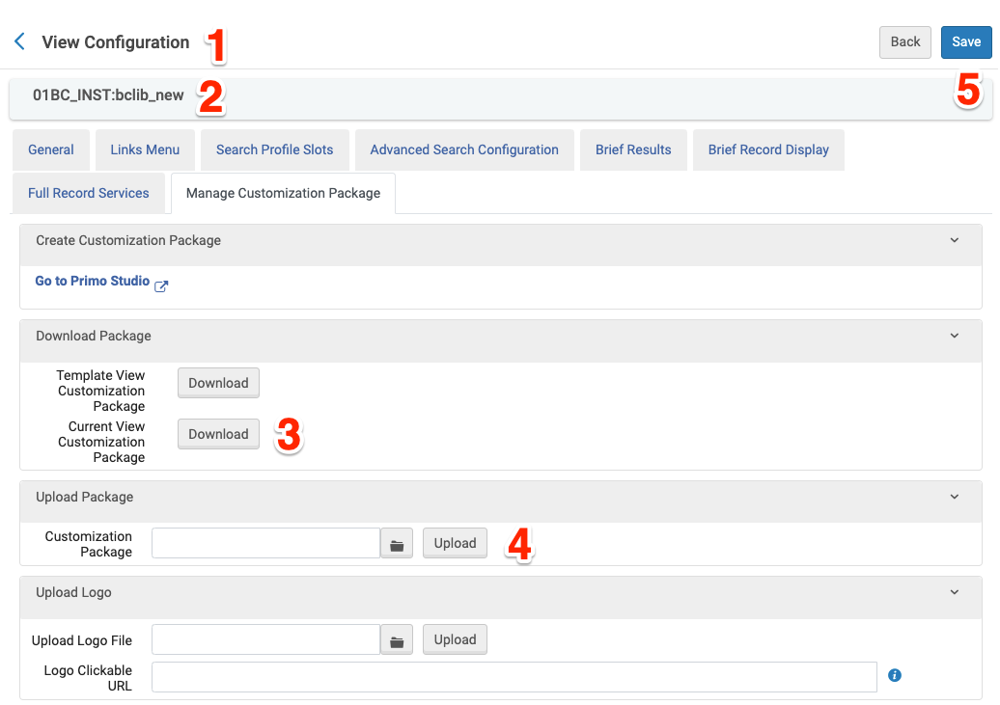

# BC Primo Customizations

- [Setting up the primo development environment](#setting-up-the-primo-development-environment)
- [Local development](#local-development)
- [Making changes to a custom package](#making-changes-to-a-custom-package)
- [Running tests](#running-tests)
- [Packaging your customizations](#packaging-your-customizations)


## Setting up the primo development environment

### Download the Primo Development Environment 

```sh
# ~/Projects
git clone git@github.com:BCLibraries/primo-explore-devenv.git
```

### Install dependencies

- [node version 16.17.0](https://nodejs.org/download/release/v16.17.0/)
- npm
- gulp

### Install node modules

```sh
# ~/Projects/primo-explore-devenv
npm install
```

### Configure the proxy server

The local development environment connects to our production or staging instance of Primo via proxy. 

```javascript
// primo-explore-devenv/gulp/config.js
var PROXY_SERVER = 'https://bc-primo.hosted.exlibrisgroup.com:443';
```

### Download BC Primo Customizations 

Development will be easier if you download into the parent directory and name the local repo bclib_new, after the repo name
```sh
# ~/Projects
git clone git@github.com:BCLibraries/bc-primo-customizations.git bclib_new
```
### Install BC Primo Customization packages

```sh
# ~/Projects/bclib_new
npm install
```

### Link BC Primo Customizations to custom view location

```sh
# ~/Projects/bclib_new
ln -s ~/Projects/bclib_new ~/Projects/primo-explore-devenv/primo-explore/custom/
```

## Local development

### Run a local development server

```sh
# ~/Projects/primo-explore-devenv
gulp run --view bclib_new
```
### Viewing the local development instance of Primo

Visit http://localhost:8003/primo-explore/search?vid=bclib_new in your browser.

### Making changes to the view

Basic styles and templates can be changed in ```bc-primo-customizations```. Customization that changes or adds functionality is contained in separate [packages](package.json). A feature can be added or removed by editing [js/aaa_bootstrap.js](js/aaa_bootstrap.js) and installing or removing the npm package.

## Making changes to a custom package

### Download the package

```sh
# ~/Projects
git clone git@github.com:BCLibraries/primo-explore-bc-availability.git
```
### Link to the development environment

~~~sh
# ~/Projects/primo-explore-bc-availability
sudo npm link
~~~

~~~sh
# ~/Projects/bclib_new
rm -rf node_modules/primo-explore-bc-availability
npm link primo-explore-bc-availability
~~~

## Running tests

### Run tests

~~~sh
# ~/Projects/primo-explore-bc-availability
gulp run-tests --view bclib_new
~~~

## Packaging your customizations

### Switch customized packages to remote version

~~~sh
# ~/Projects/bclib_new
rm -rf node_modules/primo-explore-bc-availability
npm install 
~~~

### Create the package

~~~sh
# ~/Projects/primo-explore-devenv
gulp create-package --view bclib_new
~~~

~~~sh
# ~/Projects/primo-explore-devenv/packages/bclib_new.zip
~~~

### Upload and deploy the package

Visit the Primo Backoffice and navigate to Deploy & Utilities > Customization Manager

1. Choose bclib_new from the dropdown
2. Download the current version of bclib_new.zip as a backup in case something goes wrong
3. Upload the new version of bclib_new.zip
4. Deploy


